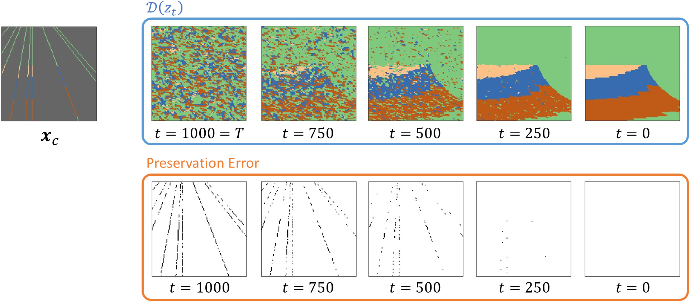

# Latent Diffusion Model for Conditional Reservoir Facies Generation

This is an official GitHub repository for the PyTorch implementation of [Latent Diffusion Model for Conditional Reservoir Facies Generation](https://arxiv.org/abs/2311.01968#:~:text=Latent%20Diffusion%20Model%20for%20Conditional%20Reservoir%20Facies%20Generation,-Daesoo%20Lee%2C%20Oscar&text=Creating%20accurate%20and%20geologically%20realistic,the%20oil%20and%20gas%20sector.).
The paper proposes conditional reservoir facies generation via diffusion modeling.
This is the first paper to apply a diffusion model for conditional reservoir modeling.

The following figure illustrates the gradual generation process (_i.e.,_ noise to sample).

<p align="center">

</p>


## Install / Environment setup
You should first create a virtual environment, and activate the environment.
Then you can install the necessary libraries by running the following command.
```commandline
pip install -r requirements.txt
```
You might encounter some error with PyTorch due to your device's compatible versions. 
Then, you can install the right PyTorch version for your device.

## Dataset Download
The used dataset in the paper is stored in `dataset/facies_5000.zip`. 
You can simply unzip it to get `facies_5000.npy` (numpy array file that contains 5000 samples).
The preprocessing code takes `dataset/facies_5000.npy` as input.

## Configuration
- `configs/ldm.yaml`: configuration for the proposed LDM.
- `config/unet_ga.yaml`: configuration for the GAN.

Detailed description of each item in the configuration is included as annotation.

## Usage

#### LDM for Conditional Reservoir Facies Generation
To train the LDM, run
```commandline
python train.py --method ldm_stage1  # stage 1 training
python train.py --method ldm_stage2  # stage 2 training
```
For sampling, `sample_ldm.ipynb` provides a tutorial.


#### U-Net GAN
The [U-Net GAN](https://link.springer.com/article/10.1007/s10596-020-10027-w) paper proposed to utilize the [pix2pix-style GAN](https://arxiv.org/abs/1611.07004) for conditional facies generation.
To train the U-Net GAN, run
```commandline
python train.py --method unet_gan
```
For sampling, `sample_gan.ipynb` provides a tutorial.

